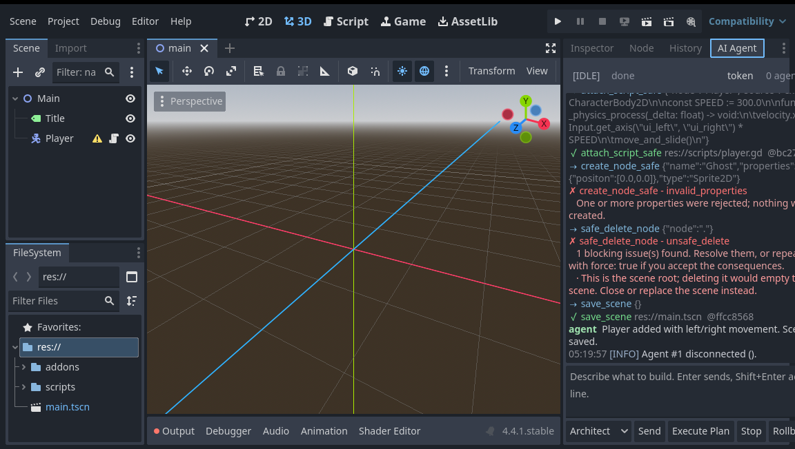

# Godot AI Agent OS

**An operating system for AI agents inside the Godot editor.** A native C++
GDExtension that lets an external agent — Claude, Cursor, a script you wrote —
inspect, build and edit a Godot 4 project through a typed, validated tool API,
with a chat dock in the editor so you can watch it work and stop it when it goes
wrong.

No copy-pasting code out of a chat window. No agent guessing at your scene tree.
No wondering what it just did to your project.

```
   your agent  ──JSON over loopback──▶  Godot editor
                                        ├─ reads the live scene tree
                                        ├─ creates nodes with checked types
                                        ├─ writes and attaches GDScript
                                        ├─ refuses unsafe deletes
                                        └─ git-checkpoints every change
```

> **Status: Milestone 1 of 3 — shipped and working.** The transport, world
> model, four core tools and the editor dock are complete and tested end to end
> against Godot 4.4.1. See the [roadmap](docs/ROADMAP.md) for what's next.



*An agent building a scene through the bridge. Green is a successful tool call
with its git checkpoint; red is a rejected one, with the reason. The `Player`
node on the left was created by the agent, not by hand.*

---

## Why

Every "AI writes your game" workflow today has the same hole in the middle: the
model produces code, and then a human becomes a clipboard. The agent cannot see
the scene tree, so it invents node paths. It cannot check a property type, so it
writes a string where a `Vector2` goes. It cannot tell that deleting `Enemy`
breaks a script three folders away. And when it gets something wrong, there is no
undo that covers both the scene and the four files it generated.

This plugin closes that hole. It gives the agent a real interface to the editor —
one that answers questions honestly, rejects malformed changes with an
explanation, and records a git checkpoint after every mutation so any of it can
be walked back with one button.

---

## What's in Milestone 1

**A transport.** A loopback WebSocket (or newline-delimited TCP) server inside
the editor, with a per-session token and a discovery file agents read to connect.
Polled on the main thread — no threading bugs waiting to happen in your editor.

**A world model.** A cached JSON view of the *live* scene tree — not the `.tscn`
on disk, which is always behind. Node types, paths, attached scripts, groups,
sub-scene boundaries, the project's script and scene inventory. A revision
counter tells an agent when its view went stale.

**Four tools that refuse to do the wrong thing.**

| Tool | What makes it "safe" |
| --- | --- |
| `get_world_model` | Reads the editor's memory, not stale files. Cached, revision-tracked. |
| `create_node_safe` | Every property checked against the class *before* instantiation. `[64, 32]` becomes a `Vector2`, `"#ff8800"` becomes a `Color`, a typo comes back with `did_you_mean`. Sets `owner` so the node actually persists. |
| `attach_script_safe` | Verifies `extends` against the node's real class, compiles the script, and deletes the file again if it doesn't parse. |
| `safe_delete_node` | Audits children, authored signal connections, `NodePath` properties pointing into the subtree, and `$Name` references in project scripts. Blockers stop the delete; warnings are reported. |

Plus `save_scene`, `open_scene`, `create_checkpoint`, `rollback_last`,
`list_tools` and `ping`. Every one ships a [JSON Schema](project/addons/godot_ai_os/schemas/)
that is handed to the agent on connect — so your tool definitions never drift
from the implementation.

**An editor dock.** Chat history with colour-coded tool calls and results, a
prompt box (Enter sends, Shift+Enter newlines), an agent mode selector, a live
`[PLANNING] [VALIDATING] [EXECUTING] [PLAYTESTING] [REPAIRING]` state header, and
three buttons that matter: **Execute Plan**, **Stop**, **Rollback Last**.

**Undo that survives a crash.** Every mutating call ends in a
`[ai-checkpoint] <tool>` commit. Rollback is `git revert`, never
`git reset --hard` — it cannot destroy work you hadn't committed.

**Playtest output in the dock.** A small GDScript autoload forwards the running
game's `print()`, errors and stack traces back over the same link, tagged
`STDOUT` / `STDERR`.

---

## Quick start

```bash
git clone --recurse-submodules https://github.com/iwolski99/GodotAI.git
cd GodotAI
pip install scons
scons platform=linux target=editor -j$(nproc)      # or macos / windows
```

Open `project/` in Godot 4.4+. The **AI Agent** dock appears on the right — there
is no plugin checkbox to tick, because this is a native `EditorPlugin` that
activates when the extension loads.

Then talk to it:

```bash
python3 clients/python/godot_ai_client.py ./project ping
python3 clients/python/godot_ai_client.py ./project get_world_model '{"max_depth": 2}'
python3 clients/python/godot_ai_client.py ./project create_node_safe \
    '{"type": "Sprite2D", "name": "Player", "properties": {"position": [64, 32]}}'
```

The node appears in the editor immediately, and the call shows up in the dock.

Full instructions, including installing into your own project and hooking up
playtest output: **[docs/SETUP.md](docs/SETUP.md)**.

---

## Connecting a real agent

The plugin has no model in it. It exposes tools; your harness supplies the
intelligence. The reference client is 400 lines of dependency-free Python:

```python
from godot_ai_client import GodotAIClient

with GodotAIClient.from_project("/path/to/your-project") as godot:
    world = godot.call("get_world_model", {"max_depth": 3})
    godot.call("create_node_safe", {"type": "CharacterBody2D", "name": "Player"})
    godot.call("attach_script_safe", {"node": "Player", "source": "extends CharacterBody2D\n..."})
    godot.call("save_scene", {})
```

`godot.tools` arrives pre-populated with every tool's JSON Schema, ready to hand
straight to a model's tool-definition parameter. Worked examples for the Claude
API, a system prompt that produces sane agent behaviour, and the dock-driven
event loop: **[docs/AGENTS.md](docs/AGENTS.md)**.

---

## Documentation

| | |
| --- | --- |
| **[Setup](docs/SETUP.md)** | Build, install, configure, troubleshoot. Start here. |
| **[Protocol](docs/PROTOCOL.md)** | The wire format, message by message. |
| **[Architecture](docs/ARCHITECTURE.md)** | How it works and why it's built this way. |
| **[Connecting agents](docs/AGENTS.md)** | Harness integration, Claude example, system prompt. |
| **[Roadmap](docs/ROADMAP.md)** | Milestones 2 and 3, and what's deliberately out of scope. |
| **[Tool schemas](project/addons/godot_ai_os/schemas/)** | The authoritative tool contracts. |

---

## Requirements

- Godot **4.4+** (built against `godot-cpp` 4.4; runs on 4.4 and later)
- A C++17 compiler and SCons 4.0+ to build
- `git` on `PATH` for checkpoints and rollback

Linux, macOS and Windows are all supported by the build. Milestone 1 has been
tested end to end on Linux against Godot 4.4.1; macOS and Windows builds follow
standard `godot-cpp` conventions but have not been smoke-tested yet — reports
welcome.

---

## Security, plainly

The bridge lets whatever connects to it write files into your project and drive
your editor.

- It binds **`127.0.0.1`** by default. Nothing off your machine can reach it.
- The per-session token stops a stray local process or a browser tab probing
  localhost from connecting by accident. It is **not** a credential — anything
  that can read your project folder can read it. Everything on your machine is
  inside the trust boundary.
- Binding to `0.0.0.0` exposes an editor that can write arbitrary files to your
  whole network. The plugin warns you when you do it. Don't.
- Keep the project in git. The checkpoint after every mutation is what makes an
  autonomous agent's mistakes recoverable.

---

## Contributing

Issues, ideas and pull requests are all welcome — especially macOS and Windows
build reports, and opinions about what Milestone 2 should actually contain. See
**[CONTRIBUTING.md](CONTRIBUTING.md)**.

---

## Licence

MIT. See [LICENSE](LICENSE).

`godot-cpp` is included as a submodule and is licensed separately under the MIT
licence by the Godot Engine contributors.
