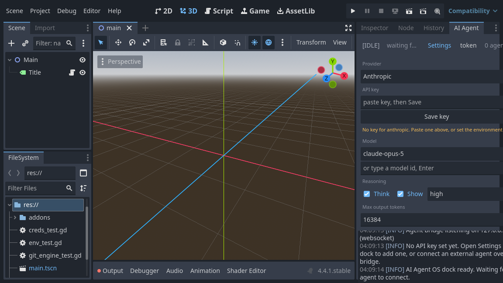

# Setup guide

From a clean machine to an agent editing your scene. Fifteen minutes, most of it
waiting on the first compile of `godot-cpp`.

---

## 0. What you need

| Requirement | Notes |
| --- | --- |
| **Godot 4.4 or newer** | The editor build, not a headless export template. Download from [godotengine.org](https://godotengine.org/download). |
| **A C++17 compiler** | GCC 9+ / Clang 10+ / MSVC 2019+. |
| **Python 3.8+ and SCons 4.0+** | `pip install scons` |
| **Git** | Required at runtime too — checkpoints and rollback shell out to it. |

Platform specifics:

- **Linux** — `sudo apt install build-essential python3-pip pkg-config` (or your
  distro's equivalent).
- **macOS** — `xcode-select --install`, then `pip3 install scons`.
- **Windows** — install Visual Studio 2019+ with the "Desktop development with
  C++" workload, then run the build from a *Developer Command Prompt*.

---

## 1. Clone with submodules

`godot-cpp` is pinned as a submodule, so the C++ bindings always match the
Godot version this plugin was tested against.

```bash
git clone --recurse-submodules https://github.com/iwolski99/GodotAI.git
cd GodotAI
```

Already cloned without `--recurse-submodules`? Fix it with:

```bash
git submodule update --init --recursive
```

---

## 2. Build

```bash
scons platform=linux target=editor -j$(nproc)                 # Linux
scons platform=macos target=editor -j$(sysctl -n hw.ncpu)     # macOS
```

```bat
scons platform=windows target=editor -j%NUMBER_OF_PROCESSORS%
```

The first run compiles `godot-cpp` as well and takes 5–20 minutes depending on
your machine. Later builds only recompile what you changed and take seconds.

The library lands directly in the addon folder:

```
project/addons/godot_ai_os/bin/libgodot_ai_os.linux.editor.x86_64.so
project/addons/godot_ai_os/bin/libgodot_ai_os.windows.editor.x86_64.dll
```

<details>
<summary><strong>Windows, in more detail</strong></summary>

Windows is the platform most likely to trip you up, so the specifics:

**1. Use the Developer Command Prompt.** Install Visual Studio 2019 or newer with
the *Desktop development with C++* workload, then launch **x64 Native Tools
Command Prompt for VS**. A plain `cmd` or PowerShell will not have `cl.exe` on
`PATH`, and SCons will either fail to find a compiler or silently pick a 32-bit
one.

```bat
cd C:\path\to\GodotAI
pip install scons
scons platform=windows target=editor -j%NUMBER_OF_PROCESSORS%
```

**2. Line endings are handled for you.** The repository ships a `.gitattributes`
that normalises text files to LF. Without it, a Windows checkout rewrites every
file to CRLF and the plugin's own git checkpoints show the entire project as
modified on the first run — which makes every checkpoint useless and every diff
unreadable. If you cloned before this existed, refresh the working tree once:

```bat
git rm --cached -r .
git reset --hard
```

**3. Git must be findable.** Checkpoints and rollback shell out to `git`. The
plugin looks in this order:

1. `%GODOT_AI_OS_GIT%`, if you set it to a full path to `git.exe`
2. `git` on `PATH`
3. `%ProgramFiles%\Git\cmd\git.exe`
4. `%ProgramFiles(x86)%\Git\cmd\git.exe`
5. `%LOCALAPPDATA%\Programs\Git\cmd\git.exe`
6. GitHub Desktop's bundled copy
7. `C:\Program Files\Git\cmd\git.exe`

So a normal *Git for Windows* install works with no configuration, and a portable
or unusual install works by setting one environment variable. The dock tells you
which it found — or that it found none.

No console windows flash up: git is invoked with `open_console = false`.

**4. Paths with spaces are fine.** Arguments are passed as an array to
`OS::execute`, never concatenated into a command line, so
`C:\Users\Your Name\Documents\My Game` needs no quoting.

**Status:** the Windows code paths are written and reviewed but have **not** been
smoke-tested on a Windows machine — the development environment for this project
is Linux. Everything above follows from the implementation rather than from a
successful run. If you build on Windows, a report either way is genuinely useful:
[open an issue](https://github.com/iwolski99/GodotAI/issues).
</details>

<details>
<summary>Build options</summary>

| Flag | Meaning |
| --- | --- |
| `target=editor` | Debug symbols, editor build. What you want while developing. |
| `target=template_release` | Optimised. The plugin is still editor-only; this just makes it faster. |
| `dev_build=yes` | Extra assertions from `godot-cpp`. |
| `-j<N>` | Parallel jobs. Use your core count. |
| `scons -c` | Clean. |

Cross-compiling and other platforms follow the standard `godot-cpp` conventions —
anything that works there works here.
</details>

---

## 3. Open the demo project

Open `project/` in Godot. That's it — the dock appears on the right straight
away.

There is **no "enable plugin" checkbox**. This is a native `EditorPlugin`
registered from C++ (`EditorPlugins::add_by_type`), so it activates the moment
Godot loads the extension. If you want it off, delete the `.gdextension` file or
set `ai_agent_os/transport/enabled = false`.

You should see, in the Output panel:

```
[AI Agent OS] Bridge ready on 127.0.0.1:45857 — connection details in res://.godot/ai_agent_os/session.json
```

If the dock is not visible, check **Editor → Editor Layout → Reset Layout**, or
look in the right-hand dock tabs for **AI Agent**.

---

## 4. Install into your own project

Copy one folder:

```bash
cp -r project/addons/godot_ai_os /path/to/your-project/addons/
```

Your project needs the `bin/`, `schemas/` and `runtime/` subfolders and the
`.gdextension` file. Then restart the editor.

Optional but recommended:

```bash
cd /path/to/your-project
git init && git add -A && git commit -m "before letting an agent in"
```

Without a git repository, checkpoints and the Rollback button are disabled — the
plugin says so rather than silently doing nothing.

---

## 5. Configure the built-in agent

Milestone 2 added an agent that runs *inside* the editor: you type a goal in the
dock, and the plugin drives the whole
[Plan → Validate → Execute → Observe → Repair](PIPELINE.md) loop itself. It needs
a model, which means an API key.

*(This is optional. If you would rather drive the plugin from your own harness
over the bridge, skip to step 6 — that path needs no key at all.)*

Open the **AI Agent** dock and press **Settings**:



| Field | What to put in it |
| --- | --- |
| **Provider** | `Anthropic` talks to the Claude API directly. `OpenRouter` proxies hundreds of models — Claude, GPT, Gemini, open-weights — behind a single key. |
| **API key** | Paste, then **Save key**. The field clears itself immediately. |
| **Model** | Press **Refresh** to fetch the provider's current list, or type an id and press Enter. |
| **Think / Show** | Whether the model reasons before answering, and whether that reasoning is printed in the dock. |
| **Effort** | `low` → `max`. How hard it thinks. |
| **Max output tokens** | Ceiling for one reply. Reasoning tokens count against it. |

Model ids are **not** interchangeable between providers — `claude-opus-5` for
Anthropic, `anthropic/claude-opus-4.1` for OpenRouter — so the plugin remembers
one per provider and switches between them with the dropdown.

### Where the key is stored

Two options, and the second is better:

**1. The encrypted store (what the Save button uses).** Written to
`user://godot_ai_os/credentials.enc` — outside your project entirely:

| OS | Location |
| --- | --- |
| Windows | `%APPDATA%\Godot\app_userdata\<project>\godot_ai_os\` |
| Linux | `~/.local/share/godot/app_userdata/<project>/godot_ai_os/` |
| macOS | `~/Library/Application Support/Godot/app_userdata/<project>/godot_ai_os/` |

The file is encrypted with a passphrase derived from the machine, so copying it to
another computer gets you nothing. Be clear about what that is and is not: it is
encryption at rest against casual disclosure, **not** a keychain. Anything running
as you on this machine can derive the same passphrase and read it.

**2. An environment variable (safer).** Set `ANTHROPIC_API_KEY` or
`OPENROUTER_API_KEY` before launching Godot. These are checked *first* and are
never written anywhere:

```bash
export ANTHROPIC_API_KEY="sk-ant-..."      # Linux / macOS
```

```bat
setx OPENROUTER_API_KEY "sk-or-..."        :: Windows, then reopen the terminal
```

When an environment variable is set, the dock says so explicitly — because
otherwise someone pastes a key, sees no effect, and concludes the plugin is
broken.

> **A key never goes anywhere near `res://`.** A key in the project folder gets
> committed, pushed, and scraped. This is a plugin for public repositories, so
> that is a matter of when, not if.

### Agent behaviour settings

**Project → Project Settings → AI Agent OS → agent**:

| Setting | Default | Effect |
| --- | --- | --- |
| `max_turns` | 24 | Hard cap on model turns per run. Stops a loop running up a bill. |
| `max_repair_attempts` | 3 | Consecutive failures before the pipeline rolls back and stops. |
| `auto_playtest` | on | After a batch that called `save_scene`, run a short smoke playtest before continuing. |
| `auto_rollback` | on | `git reset --hard` to the step snapshot when the repair budget is spent. |
| `require_brief` | on | Interview before build in architect/coder modes. |
| `driver_lock` | on | Refuse IPC mutations while the built-in pipeline holds the project. |
| `dock_routing` | Auto | `Auto` / `Built-in` / `External` — where dock prompts go when a key and/or IPC client exist. |

---

## 6. Connect an external agent

The plugin writes everything a client needs to
`<project>/.godot/ai_agent_os/session.json`:

```json
{
  "protocol": "godot-ai-os/1",
  "host": "127.0.0.1",
  "port": 45857,
  "transport": "websocket",
  "token": "9f2c…",
  "project_path": "/home/you/your-project/"
}
```

`.godot/` is already in Godot's default `.gitignore`, so the token never gets
committed.

Try the bundled client:

```bash
python3 clients/python/godot_ai_client.py ./project ping
python3 clients/python/godot_ai_client.py ./project get_world_model '{"max_depth": 2}'
python3 clients/python/godot_ai_client.py ./project create_node_safe \
    '{"type": "Sprite2D", "name": "Player", "properties": {"position": [64, 32]}}'
```

The node appears in the editor immediately, and the dock logs the call. See
[PROTOCOL.md](PROTOCOL.md) for the full message format and
[AGENTS.md](AGENTS.md) for wiring this up to Claude or Cursor.

---

## 7. Playtest output

**Playtests the agent starts need no setup.** The `run_playtest` tool launches the
game with Godot's `--log-file` flag and tails the result, so `print()`, engine
errors and GDScript stack traces come back as structured diagnostics — with file,
line and function — automatically. That is the
[Observe stage](PIPELINE.md#intercepting-the-running-game).

**Playtests *you* start with the editor's Play button** are a different process
that the plugin did not launch, so if you want those in the dock too, add the
bridge autoload in **Project → Project Settings → Globals → Autoload**:

| Path | Name |
| --- | --- |
| `res://addons/godot_ai_os/runtime/agent_log_bridge.gd` | `AgentLogBridge` |

Also enable **Project Settings → Debug → File Logging → Enable File Logging**.

The autoload removes itself in exported builds, so it is safe to leave enabled.

---

## Configuration

**Project Settings → General → AI Agent OS** (toggle *Advanced Settings* to see
the category):

| Setting | Default | What it does |
| --- | --- | --- |
| `transport/enabled` | `true` | Master switch for the agent bridge. |
| `transport/mode` | `WebSocket` | Or `TCP JSON Lines` for clients without a WebSocket library. |
| `transport/port` | `45857` | Change it if something else owns the port. |
| `transport/bind_address` | `127.0.0.1` | **Leave this alone** unless you understand the consequences — see below. |
| `transport/require_token` | `true` | Require the session token in the handshake. |
| `vcs/auto_checkpoint` | `true` | Commit a checkpoint after every mutating tool call. |

Settings are read when the plugin starts. Restart the editor after changing them.

---

## Security

The bridge lets whatever connects to it write files into your project and drive
your editor. Treat it accordingly:

- It binds **127.0.0.1** by default. Nothing outside your machine can reach it.
- The session token stops a random local process — or a web page probing
  `localhost` ports — from connecting by accident. It is **not** a credential:
  anything that can read your project folder can read the token. Everything on
  your machine is inside the trust boundary.
- Setting `bind_address` to `0.0.0.0` exposes your editor to your whole network
  with no meaningful authentication. The plugin logs a warning when you do it.
  Don't do it on a shared or untrusted network.
- Agents can create and overwrite files anywhere under `res://`. The git
  checkpoint after every mutation is what makes that recoverable — keep your
  project in git.

---

## Troubleshooting

**The dock doesn't appear.**
Check the Output panel for a GDExtension load error. The usual cause is a
library built for a different Godot version than the one you are running; check
`compatibility_minimum` in `godot_ai_os.gdextension` against your editor's
version, and rebuild.

**`Could not listen on 127.0.0.1:45857`.**
Another Godot instance with this plugin is already running, or something else
owns the port. Close the other editor, or change `transport/port`.

**`git_unavailable` from every checkpoint.**
The project directory is not a git work tree, or `git` is not on the `PATH` that
Godot inherited. On macOS, launching Godot from Finder gives it a minimal `PATH`;
launching from a terminal fixes it.

**An agent connects and is immediately dropped.**
Its token is stale. The token is regenerated every time the editor starts —
re-read `session.json` on connect rather than caching it.

**Scene edits vanish after a restart.**
Scene changes live in the editor's memory until saved. Call `save_scene` after a
batch of edits; the plugin will not save on your behalf, because silently writing
over a file a human is editing is worse than losing an agent's work.
